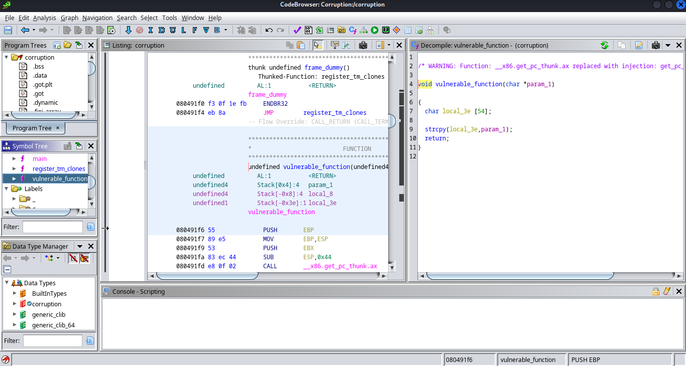

# dvGPT

## Leaky

**Points:** 75

**Author:** Nate Singer (helix)

**Description:** People leave dumb comments about vulnerabilities all over client-side code... most modern web applications don't display all the possible code at once though, for a variety of reasons.

**Links:** https://wtashuxsyj.final.hackabit.com/

Based on the challenge description describing "dumb comments about vulnerabilities all over client-side code," it is pretty clear that the flag can be found in client-side code.

So let's start up DevTools!

If we look in the elements tab, we can find an interesting ID as a part of the chat modal:


If we then look for the chat panel in the sources tab through `dvgpt/src/components/ChatPane.vue`, we find even more:


From this, we can get the flag, `flag{the_DOM_is_like_crazy_virtual_maaaan}`


## Extractor

Now, looking at this, it seems we have to do some LLM prompt engineering.

Let's start simple:


Now again...


So it seems we have to be Robert to get the flag...


And there we have it, the flag is `flag{hey_you're_not_robert}`!

## BadML

Since this challenge discusses endpoints, let's try the DevTools network tab to see what requests are made...


Most of these endpoints seem to be simple JS and CSS files, which you won't be able to get much out of, them being client-side code. However, `/footer` provides something interesting, with a parameter of `message` in the search query.

If we open that endpoint in a new tab, assuming the `message` parameter points to a file, we can set `?message=flag.txt` to get access to the flag.


And there we have the flag, `flag{LFI_LetsgoFindIt}`!

## BadAI
Do later

# Corruption

## Santa

This first challenge is relatively simple. Let's launch `ghidra` to look a bit more at the code for the binary file, `corruption`!

Analyzing with the defaults, we can look at the symbol tree to find the data stored in the binary file.

Nested under `Labels/f`, we find a label interestingly named `flag`! Let's look at that!


And there's our flag, `flag{baby_steps_gift_just_for_you}`!

## Coredump

Now, we have to actually develop a payload for the binary file as it runs. We also have a remote location to connect to, `juieqtrsdp.final.hackabit.com:54321`.

Looking in ghidra at the `main` function, we can find something interesting: `strncmp` is used to compare the first bits of our input to `"UNLOCK"`.


We can tell this since `fgets` reads the first 500 characters of `stdin` into `local_23e`, which is compared to `local_18`, set to `"UNLOCK"`, using the first `__n` characters, which is defined as the length of `local_18`, essentially meaning that the input must begin with `"UNLOCK"` for iVar1 to be 0, since `strncmp` returns 0 when the first bytes of the strings are equal.

Now, if we connect to our remote location with netcat, we can try this payload:


It works, and now we have our flag, `flag{look_like_ur_a_real_RE}`!

## bitsANDbytes

As we start this challenge, we need to do a bit more in order to get a different flag. Looking at ghidra, we can see that the function `flag_function` includes an environment variable very similar to the title of this challenge:


This is where we start.

Looking back at `main`, we see that the address of `flag_function` is printed on program execution, and the code exits with an interestingly-named function, `vulnerable_function`.


Looking at `vulnerable_function`, it seems that `local_3e` might be vulnerable to buffer overflow, as the payload extends beyond 54 characters.



Let's open GDB and locally try a 54-character payload beginning with `UNLOCK`.


It seems to exit normally, but let's keep trying adding additional characters until we get a different exit address:


Now, let's keep trying until we can manipulate this address:


Now, we have 30 at the end of our exit address, which is the hexadecimal code for `0`.

Let's replace this last 0 with 4321:


`0x31323334` is hexadecimal for `1234`, meaning if we replace `4321` with the correct bytes in reverse, we can directly control this exit location.

Let's convert our payload to hexadecimal so we can manipulate this address accordingly.


The payload ends with `0a` to print a new line at the end. However, if we edit the previous 8 characters, we can control the exiting address and set it to `flag_function`.

If we connect remotely through netcat, we find the address `0x804920d`. Therefore, the final bytes of our payload must be `0d920408`, followed by the `0a` for the new line.


Now, if we use `xxd` to convert back to bytes and pipe this into our netcat connection, we can get the flag!


And our flag is `flag{big_ret2flag_energy}`!

## Controller

This challenge works very similarly to bitsANDbytes, but we need to use the function `controller_flag` instead. 

Using GDB, we can find the addresses locally of each function:


Our addresses are `0x08049221` and `0x08049264`.

If we use JavaScript to quickly apply the same offset to the `flag_function` address of our local connection, we get `0x08049250`.


So, if we use this new address for our payload, we can get this flag!


And our flag is `flag{almost_totally_full_control}`!


# Triage

## Sluth

As we download the file, `morse.txt`, it is clear the name refers to Morse Code, and based on the challenge description, it is clear that this is iterative, meaning this is a Morse Code code in Morse Code!

Let's look at the file through our browser (mousepad crashes due to the file size) so we can see the format clearly:


Normally, Morse Code uses a space to separate characters. However, this seems to use `/`, which is usually used to separate words.

An alternative for separating words is two spaces, so we can also suggest that two `/`s can mean the same thing with this format. 

We can also use the online Morse Code translator for this, `https://morsecode.world/international/translator.html`.

In our JavaScript console, we can define a function to help process this information:
```js
const go = txt => copy(txt.split("  ").join("#").split(" ").join("").split("#").join(" "));
```

Since the translator converts `/` to spaces, we want to get rid of single-spaces while preserving double-spaces as single-spaces, which this function does. Since it automatically copies the data, each iteration, we can just run this function on the output and paste the result in the input box.

Ultimately, we get this:


The translator fails on `..--.-`, but with a quick Google search, we find that this is the underscore character, meaning our flag (non-standard format) is `FIVE_TIMES_0.O`.

## Inspector

In this challenge, we are given a PCAP file to analyze, which we can open with Wireshark!

Once in Wireshark, since we can assume from the challenge description that the flag is in plaintext, we can just search for a partial string, `g{` from the flag format, or `677b` in hexadecimal.

Doing this, we eventually find an HTTP request with an interesting ending to the request:


Although the flag is broken up some, we have our flag, `flag{tcp_streams_reveal_more}`!

## Coverup

In this challenge, since we are given an image and told there is information within it, we know it uses steganography. 

Two of the most common steganography extraction tools are `binwalk` and `steghide`. Here, `binwalk` returns nothing of use, but `steghide` gives us something interesting.

It asks for a passphrase as usual, but leaving it blank still gives us the flag!


And our flag is `flag{the_truth_is_burried_deep}`!

## Extraction

Going back to our PCAP file, we know there is something else hidden in there.

Quite a few interesting things can be found, including a hostname, MEOWMEOW that seems to be doing interesting things on the network, and information on a bunch of Macs and iPads, but none of these are the flag.

However, looking at DNS requests, we find some interesting URLs...


The subdomain appears to be binary, and the first, `01100110`, translates to `f`, the beginning of the traditional `flag{}` format.

All of these use the hackabit domain, so we can search for that to collect the required subdomains.

Collecting all of these subdomains as binary and putting them into a binary translator such as `https://www.rapidtables.com/convert/number/binary-to-ascii.html`, we can get our flag!


And our flag is `flag{what_firewall?_what_IDS?}`!


# Range

## Connection


